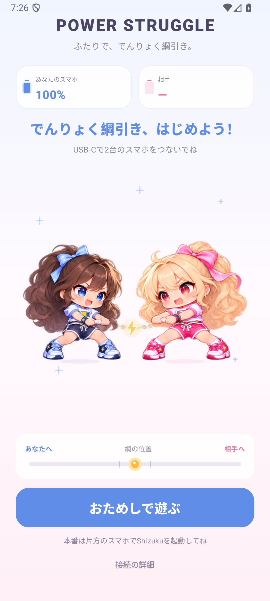
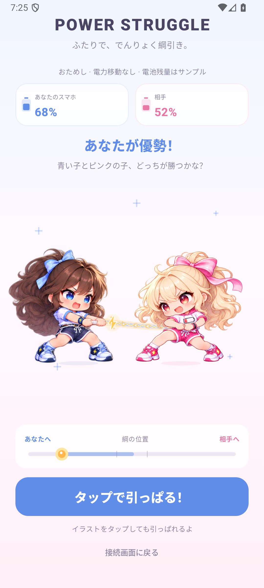
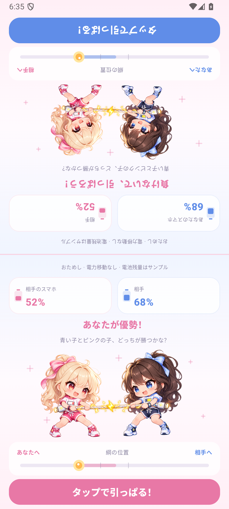
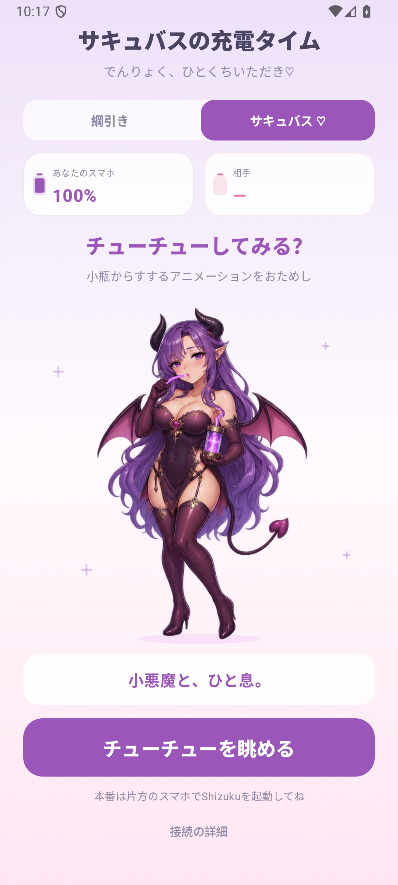
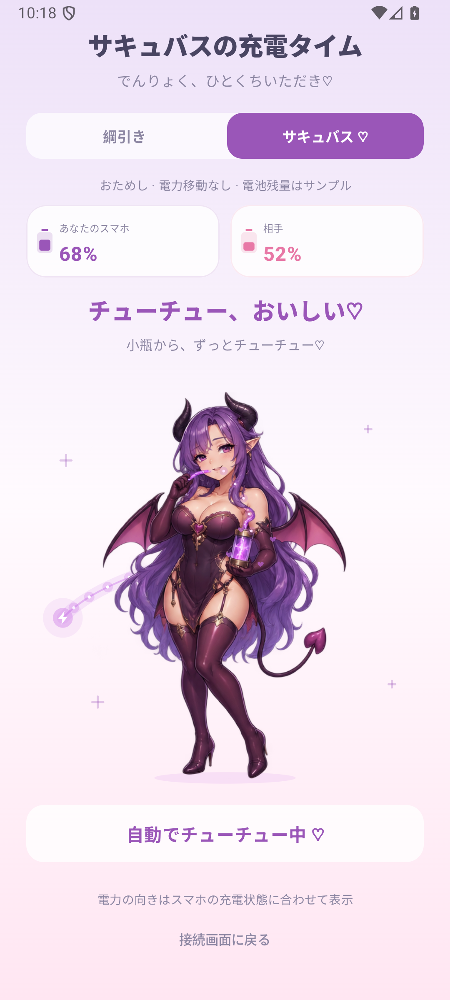
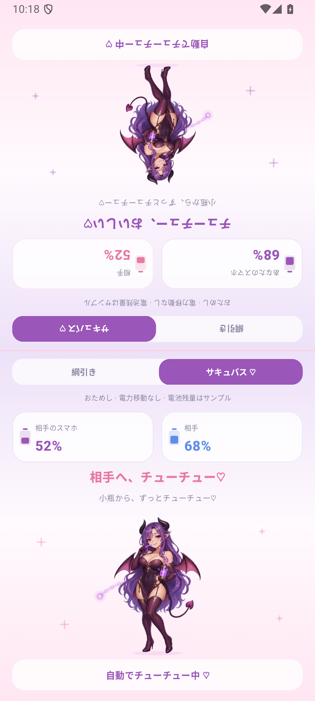

# ⚡️ Power Struggle

## This fork: でんりょく綱引き

This is [kumi0708's fork](https://github.com/kumi0708/power-struggle) of
[kenkawakenkenke/power-struggle](https://github.com/kenkawakenkenke/power-struggle).
Two chibi girls pull a glowing energy cable in a pastel Japanese game UI. Each girl has
separate hand-drawn pull poses, blinks and advantage/strain expressions. A continuous mesh
animation adds torso/knee movement and hair/ribbon sway while keeping the feet planted.
Taps accelerate the local pull, and the rope connects the animated hand grips. The tug meter
follows the existing USB game state. The battery
percentage and charging status in connected play still come from the device's battery readings.

- Tap the illustration or **タップで引っぱる！** to pull.
- Before connecting, choose **おためしで遊ぶ** to try the visuals. This is a local simulation:
  battery levels are sample values, and taps never trigger USB messages or power swaps.
  Connecting a real opponent automatically returns to live play.
- The bottom-to-bottom, face-to-face orientation and the one-phone split mode are preserved.
  In two-phone play, the referee is the blue girl and the player is the pink girl; each device
  mirrors the scene as needed so its own girl matches the local tug meter.
- **接続の詳細** contains Shizuku setup instructions and connection diagnostics.
- Choose **サキュバス ♡** for an alternate viewing mode: an adult fantasy character
  continuously sips glowing electricity from a small bottle through a straw, with four expression poses,
  breathing and animated hair/wings. No tapping is needed. **チューチューを眺める** starts
  a clearly labeled local preview; connected play shows the actual direction of power flow.
  This visual mode does not send game taps or request automatic power swaps. Switch back to
  **綱引き** to resume tapping. The selected visual mode is remembered across app restarts
  and shared by both sides in one-phone mode.
- The application ID is `com.kumi0708.powerstruggle`, so this fork can coexist with the original.

The approved artwork and its generation prompt are in [`docs/art`](docs/art). The runtime
atlases are `tug_emotes_atlas.png` and `tug_pink_pull_atlas.png` in
`app/src/main/res/drawable-nodpi/`. Their source rectangles, planted-foot pivots and hand grips
are registered in `TugAnimation.kt`; the generated PNGs are preserved intact.
See [`the animation prompts`](docs/art/tug-animation-prompts.md) for the artwork instructions.
The alternate-mode artwork is `succubus_sip_atlas.png`: the user's approved four-pose
reference, with its purple corset outfit, long gloves and thigh-high boots, copied intact.
The small bottle and straw remain in the illustration. Facial expression changes combine
with continuous sipping, breathing, hair and wing movement. Purple energy particles follow
the charging direction. See [`the reference adoption record`](docs/art/succubus-reference-v0.7.md)
and [`the original generation prompt`](docs/art/succubus-sip.prompt.md).

<p align="center">
  
  
  
</p>

<p align="center">
  
  
  
</p>

Build and check with JDK 17+ and the Android SDK:

```sh
./gradlew assembleDebug lintDebug
```

The APK is generated at `app/build/outputs/apk/debug/app-debug.apk`.
Real USB power transfer still needs two compatible physical devices and Shizuku on one phone.

Debug builds accept `preview_scene` (`charging`, `draining`, or `split`) and
`preview_face_up` intent extras for emulator UI checks. `preview_visual` (`succubus` or `tug`)
overrides the initial visual mode for captures. Preview scenes are labeled simulations;
the release build ignores these extras. For example:

```sh
adb shell am start -S -n com.kumi0708.powerstruggle/com.kenkawamoto.powerstruggle.MainActivity \
  --es preview_scene charging --ez preview_face_up true
```

## Original project

**A two-player tap battle over USB-C where you physically steal battery power from your opponent.**

Connect two phones with a USB-C cable and tap. Whoever is winning actually gets charged; the loser's battery really drains. For those "We're both at 5% and neither can make it home, but one of us could survive if they take the other's charge" standoffs.

📖 Project page: **[ideas.skip.work/…/power-struggle](https://ideas.skip.work/u/kenkawakenkenke/projects/power-struggle)**

<!-- TODO(ken): drag the gameplay video in here via the GitHub web editor. -->

<p align="center">
  
  &nbsp;&nbsp;
  
</p>
<p align="center"><sub>Left: two-phone mode, the winning side. Right: one-phone mode against an iPad, which can't run the app but still swaps power.</sub></p>

## How to play

- The two phones lie on the table **bottom to bottom**, joined by the cable, with a player behind each one. (That's why the UI is drawn upside down.)
- Tap anywhere to pull the knot on the energy stream towards your battery. It springs back towards the cable on its own.
- When the knot passes the line just beyond the cable, power swaps and flows to you. The phone's own status bar charging icon is your proof.
- Faster tapping = more of your opponent's battery. Losing actually costs you charge.

If the other device isn't running the app (not installed, or an iPad/iPhone), one phone shows both players on a split screen and still swaps power with the other device.

## How it works

**Swapping who charges whom.** A USB-C port on a modern phone can either supply power (source) or receive it (sink). When two phones are connected, USB Power Delivery decides which is which, and the spec also allows a _power role swap_ mid-connection without unplugging. That's what Android's "Charge connected device" USB setting does. Power Struggle triggers the same swap from inside the game by running

```
dumpsys usb set-port-roles <port> <source|sink> <host|device>
```

That needs shell-level permission, so the app runs it through [Shizuku](https://shizuku.rikka.app/), which lends an app the permissions of an adb shell. No root required. Only one phone needs this: the swap is negotiated between the two phones, and the other just accepts the request. A swap takes about half a second; afterwards roughly 4.5 W (5 V, 0.9 A on a Pixel) flows the other way.

**Game data over the same cable.** The phone running Shizuku takes the USB _host_ role and switches the other phone into [Android Open Accessory](https://source.android.com/docs/core/interaction/accessories/protocol) mode, a protocol originally meant for car head units and docks. That gives the two phones a direct, millisecond-latency data channel for taps and game state. Power role and data role are independent in USB, so the link stays up while power flips back and forth underneath it.

**Truthful UI.** Each phone's "charging / draining" display comes from its own `BatteryManager` readings, not from game messages, so the screen shows what the battery is actually doing.

Measured on a Pixel 9 Pro XL ↔ Pixel 4 XL: the supplying phone's battery drains at around 1500 mA while the receiving phone's battery gains only around 400 mA. Both screens and the animation eat into the roughly 4.5 W delivered, so use it only in a genuine emergency.

## Trying it

You need:

- **The "host" phone:** Android 13+, with [Shizuku](https://shizuku.rikka.app/) installed and running (start it via Wireless debugging; it needs restarting after each reboot).
- **The other device:** another Android phone with USB-C (ideally with this app installed too, but no need for Shizuku), or an iPad/USB-C iPhone for one-phone mode.
- A USB-C to USB-C cable that carries data, not just power.

Build and install (JDK 17+):

```sh
./gradlew installDebug
```

Open the app on both phones, plug them together, and accept the prompts: Shizuku permission and USB access on the host phone, and "Open Power Struggle" on the other one. The phone with Shizuku becomes the host automatically.

## Status and caveats

This is a proof of concept, tested only on Pixels (and against an iPad).

- `dumpsys usb set-port-roles` is a debug interface, not a public API. Other manufacturers' builds or future Android versions may not support it.
- Some phones won't supply power when their own battery is low, and the app doesn't yet enforce a battery floor of its own. Don't play it with a phone you need to keep alive.
- iPads/iPhones can't run the app over USB (no Android Open Accessory), so they're power-only opponents in one-phone mode.

## Code tour

| File                                                                                                                                                                       | What it does                                                             |
| -------------------------------------------------------------------------------------------------------------------------------------------------------------------------- | ------------------------------------------------------------------------ |
| [`Battle.kt`](app/src/main/java/com/kenkawamoto/powerstruggle/Battle.kt)                                                                                                   | Game state, tug-of-war rope, one/two-phone mode detection, wire protocol |
| [`PowerControl.kt`](app/src/main/java/com/kenkawamoto/powerstruggle/PowerControl.kt), [`ShellService.kt`](app/src/main/java/com/kenkawamoto/powerstruggle/ShellService.kt) | Shizuku user service that runs `dumpsys usb` as the shell user           |
| [`UsbLink.kt`](app/src/main/java/com/kenkawamoto/powerstruggle/UsbLink.kt)                                                                                                 | Android Open Accessory host and accessory ends of the data link          |
| [`MainActivity.kt`](app/src/main/java/com/kenkawamoto/powerstruggle/MainActivity.kt)                                                                                       | Compose UI: energy stream, knot, battery gauge, split screen             |

## License

[MIT](LICENSE) © 2026 Ken Kawamoto
